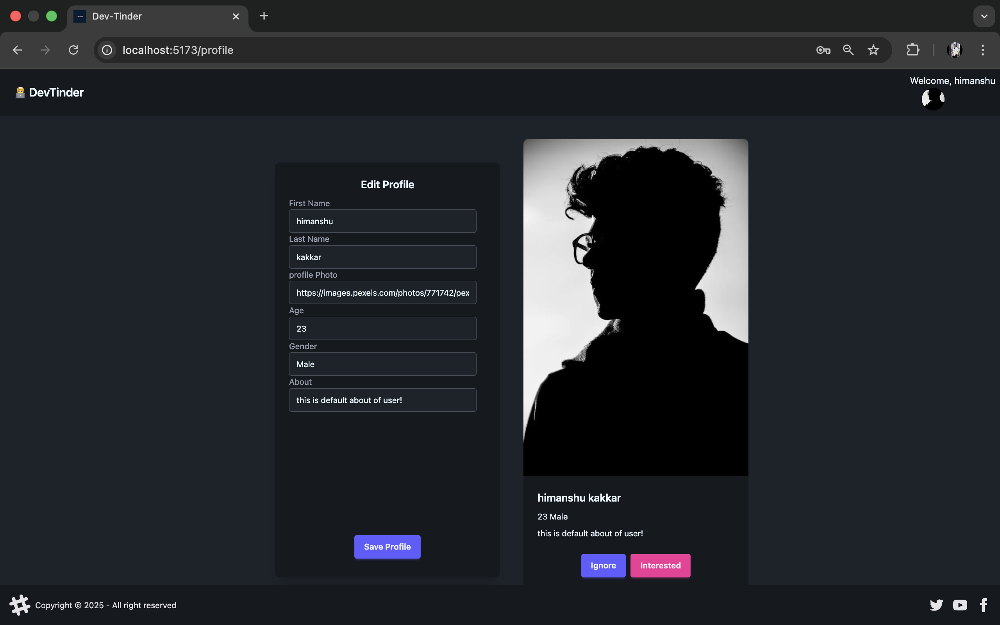
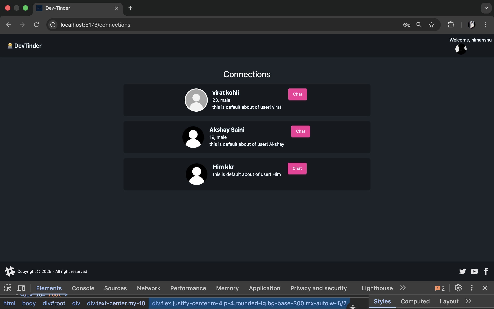
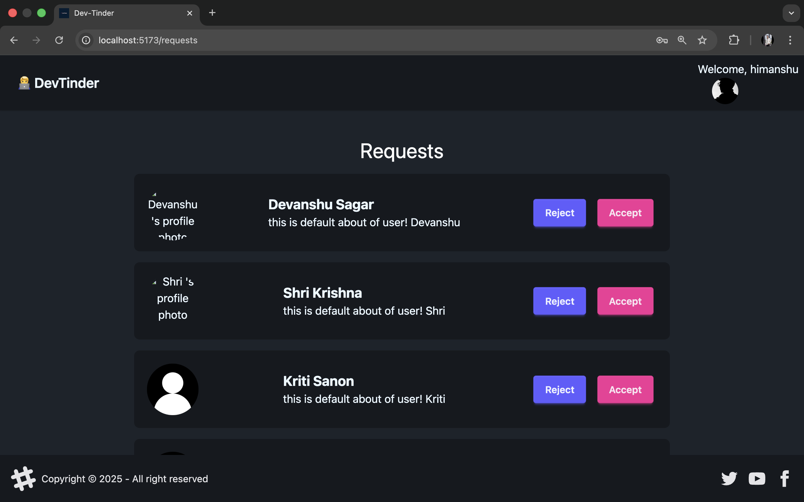
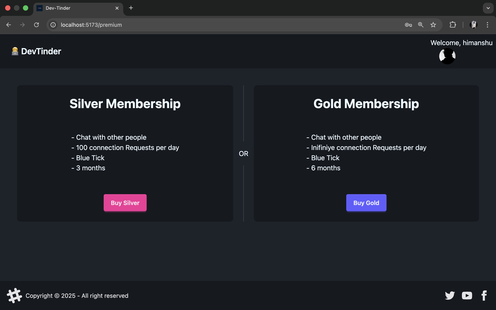
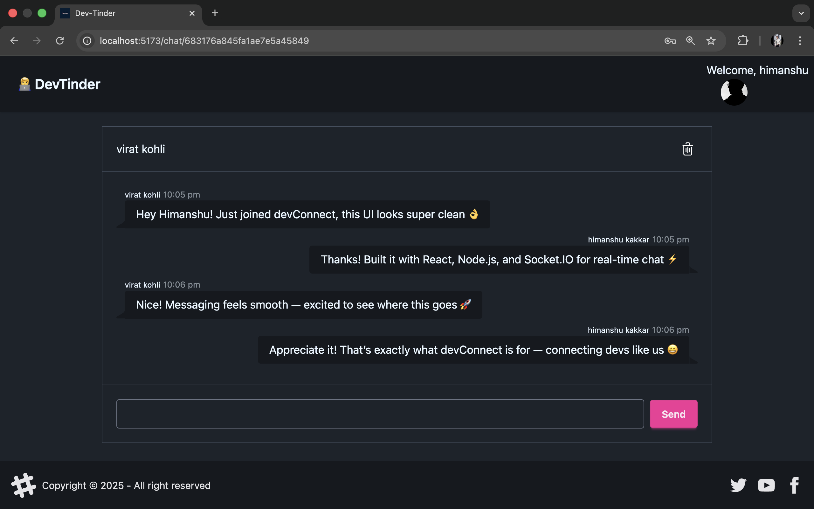

# 💻 devConnect Frontend

> This is the **frontend folder only**. The backend repo can be found [here](https://github.com/Himanshu-Kakkar/devConnect-backend).

Live URL: [devConnect.com] (https://devconnect-web-3fxq.onrender.com/)

This repo contains the **frontend code** for the **devConnect** application — a platform designed to connect developers, facilitate communication, and enable smooth collaboration.  
The frontend provides an elegant and responsive user interface for authentication, chatting, payments, and profile management.
---


## 🖼️ App Screenshots

| Feature | Preview |
|----------|----------|
| 🧑‍💻 Edit / Save Profile & Preview Page |  |
| 🤝 Connections Page |  |
| 📩 Requests Page |  |
| 💎 Purchase Premium Page |  |
| 💬 Chat Between Two Users |  |

---
---

## What This Frontend Can Do (Theoretical Overview)

The **devConnect frontend** acts as the visual layer of the platform, allowing users to interact seamlessly with the backend services. It provides:
- **User Authentication Pages** — for secure login and registration.  
- **Profile Management** — lets users create, update, and view developer profiles.  
- **Real-Time Chat UI** — connects with Socket.IO for instant communication.  
- **Payment Interface** — integrated with Razorpay for secure payments.  
- **Responsive Design** — adapts smoothly to tablet, and desktop screens.  

---

## Key Technologies & Tools Learned

During the development of this frontend, I explored and implemented several modern web technologies:

- **React.js** — for building a modular and fast single-page application (SPA).  
- **Tailwind CSS** — for sleek, responsive, and efficient styling.  
- **Axios** — for making API requests to the backend.  
- **React Router DOM** — for page navigation and route management.  
- **Socket.IO Client** — for enabling real-time chat functionality.  
- **Razorpay** — for handling payment flows on the client side.  

---

## ⚙️ How to Run the Project Locally

### 1. Clone the Repository
```bash
# Clone the frontend
git clone https://github.com/Himanshu-Kakkar/devTinder-web.git

# Move into the frontend folder
cd devTinder-web

# Step 2: Install dependencies
npm i

# Step 4: Run the app
npm run dev
